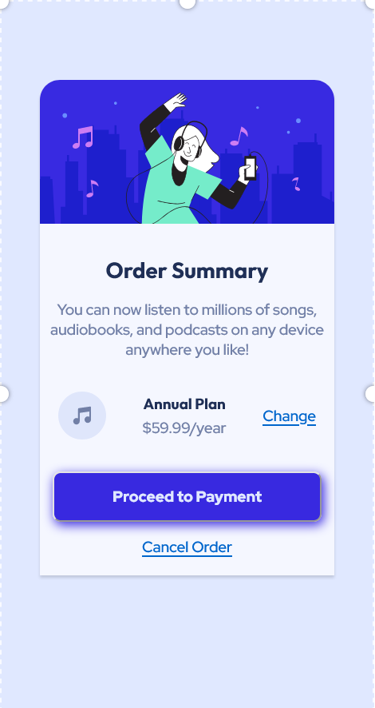

# Frontend Mentor - Order summary card solution

This is a solution to the [Order summary card challenge on Frontend Mentor](https://www.frontendmentor.io/challenges/order-summary-component-QlPmajDUj). Frontend Mentor challenges help you improve your coding skills by building realistic projects. 

## Table of contents

- [Screenshot](#screenshot)
- [Links](#links)
- [My process](#my-process)
- [Built with](#built-with)
- [What I learned](#what-i-learned)
- [Continued development](#continued-development)
- [Author](#author)


### Screenshot



### Links

- Solution URL: [Here Is My Solution](https://www.frontendmentor.io/solutions/order-summary-kfLwwHzBMl)
- Live Site URL: [Here Is My Live Site](https://snazzy-chebakia-68eb56.netlify.app)

## My process
Learned about em and rem trying make responsive layouts

### Built with

- HTML
- CSS
- Flexbox
### What I learned

I learned about :hover 
```
example:hover{
  background: var(--clr-pri-Bblue2);
  box-shadow: 0px 3px 20px hsl(245, 45%, 50%);
}

.example:hover{
  color: var(--clr-neu-Dblue);
}
```
and i learned about box shadows
```
example{
  box-shadow: 0px 3px 20px hsl(245, 45%, 50%);
  box-shadow: 0px 1.25px 1.25px rgba(0, 0, 0, 0.08);
}
```
### Continued development
How media works,Site responsivnes

## Author

- Frontend Mentor - [@kouzgr](https://www.frontendmentor.io/profile/kouzgr)

